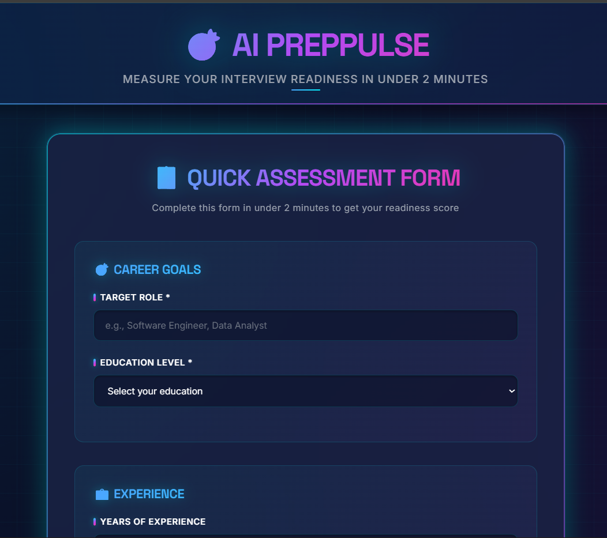
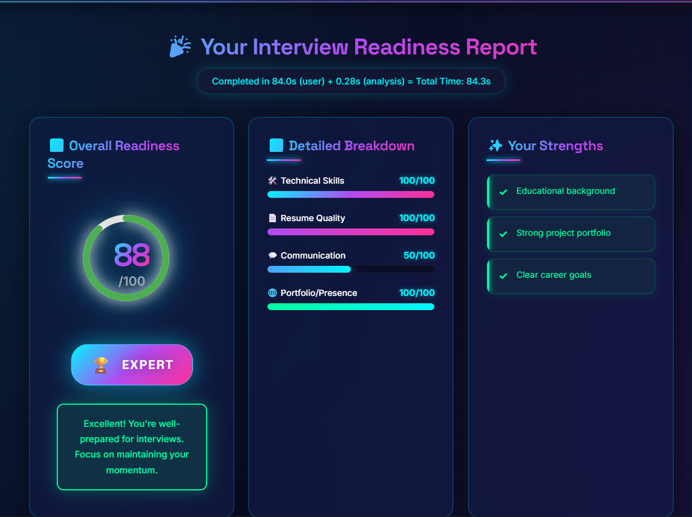

# 🎯 AI PrepPulse - Interview Readiness Assessment Tool

[](https://opensource.org/licenses/MIT)
[](https://nodejs.org/)
[](https://reactjs.org/)

**AI PrepPulse** is an innovative AI-powered tool that helps students and job seekers objectively measure their interview readiness in under 2 minutes. Get actionable insights, personalized improvement plans, and a comprehensive readiness score before facing real recruiters.

## 🎬 Demo Video

**Watch the full demo here:** 

> 📹 **[INSERT YOUR SCREEN RECORDING VIDEO LINK HERE]**
> 
> *(Please record a 5-minute video showing the complete workflow: form filling → assessment → results display)*

### Quick Demo Preview


*Screenshot showing the assessment interface and results dashboard*

---

## 🚀 Features

### ✨ Core Capabilities
- **⚡ 2-Minute Assessment**: Complete evaluation in under 2 minutes
- **🤖 AI-Powered Analysis**: Google Gemini AI provides intelligent insights
- **📊 Comprehensive Scoring**: 0-100 score with readiness levels (Beginner → Expert)
- **📈 Detailed Breakdown**: Scores for Technical Skills, Resume, Communication, Portfolio
- **✓ Strength Analysis**: Identify what you're already good at
- **🎯 Gap Identification**: Pinpoint specific areas needing improvement
- **📝 Actionable Steps**: 5+ concrete action items with timeline estimates
- **📄 Resume Parsing**: Upload and analyze PDF/TXT resumes
- **🌐 Online Presence Check**: Evaluate LinkedIn, GitHub, Portfolio profiles

### 🎨 User Experience
- Clean, modern, and intuitive interface
- Real-time progress tracking
- Responsive design (mobile & desktop)
- Downloadable results (print-friendly)
- Smooth animations and visual feedback

---

## 🛠️ Tech Stack

### Frontend
- **React.js 18.2** - UI Library
- **CSS3** - Styling with animations
- **Axios** - HTTP client for API calls
- **Recharts** - Data visualization (optional)

### Backend
- **Node.js** - Runtime environment
- **Express.js** - Web framework
- **Google Gemini AI** - AI analysis engine
- **pdf-parse** - Resume parsing
- **express-fileupload** - File handling

### Deployment Ready
- Frontend: Vercel, Netlify, GitHub Pages
- Backend: Render, Railway, Heroku, AWS

---

## 📋 Prerequisites

Before you begin, ensure you have the following installed:

- **Node.js** (v18 or higher) - [Download here](https://nodejs.org/)
- **npm** (comes with Node.js) or **yarn**
- **Google Gemini API Key** - [Get it free here](https://makersuite.google.com/app/apikey)

---

## ⚙️ Installation & Setup

### 1️⃣ Clone the Repository

```bash
git clone https://github.com/yourusername/ai-preppulse.git
cd ai-preppulse
```

### 2️⃣ Backend Setup

```bash
# Navigate to backend directory
cd backend

# Install dependencies
npm install

# Create .env file
copy .env.example .env  # Windows
# OR
cp .env.example .env    # Mac/Linux

# Edit .env file and add your Gemini API key
# GEMINI_API_KEY=your_actual_api_key_here
# PORT=5000
# NODE_ENV=development
```

**How to get Gemini API Key:**
1. Go to [Google AI Studio](https://makersuite.google.com/app/apikey)
2. Click "Create API Key"
3. Copy the key and paste it in `.env` file

### 3️⃣ Frontend Setup

```bash
# Open a new terminal
cd frontend

# Install dependencies
npm install
```

---

## 🚀 Running the Application

### Development Mode

**Terminal 1 - Backend:**
```bash
cd backend
npm start
# Server will run on http://localhost:5000
```

**Terminal 2 - Frontend:**
```bash
cd frontend
npm start
# App will open on http://localhost:3000
```

The frontend automatically proxies API requests to the backend.

### Production Build

```bash
# Build frontend for production
cd frontend
npm run build

# Serve the build folder using the backend
cd ../backend
# Add this line to server.js to serve static files:
# app.use(express.static(path.join(__dirname, '../frontend/build')));
npm start
```

---

## 📖 Usage Guide

### For Users

1. **Open the Application** at `http://localhost:3000`
2. **Fill the Assessment Form** (takes 90-120 seconds):
   - Enter your target role and education
   - Add years of experience and projects completed
   - List your technical skills
   - Rate your communication confidence
   - Provide LinkedIn, GitHub, Portfolio URLs (optional)
   - Upload your resume (PDF/TXT format, optional)
3. **Click "Get My Readiness Score"**
4. **View Your Results**:
   - Overall readiness score (0-100)
   - Readiness level (Beginner/Intermediate/Advanced/Expert)
   - Detailed breakdown by category
   - Your strengths and improvement areas
   - Personalized action plan with timeline
5. **Download or Print** your report for future reference

### Sample Test Profile

If you want to test the app quickly:

```
Target Role: Software Engineer
Education: Bachelor's Degree
Years of Experience: 2
Technical Skills: JavaScript, React, Node.js, Python, SQL
Projects Completed: 5
Communication Confidence: 7/10
LinkedIn: https://linkedin.com/in/testuser
GitHub: https://github.com/testuser
```

Expected Result: ~60-70 score (Intermediate/Advanced level)

---

## 🏗️ Project Structure

```
ai-preppulse/
├── backend/
│   ├── routes/
│   │   └── assessment.js          # API routes
│   ├── services/
│   │   └── geminiService.js       # AI analysis logic
│   ├── utils/
│   │   └── resumeParser.js        # Resume parsing utility
│   ├── server.js                  # Express server
│   ├── package.json               # Backend dependencies
│   ├── .env.example               # Environment variables template
│   └── .env                       # Your API keys (not in repo)
│
├── frontend/
│   ├── public/
│   │   ├── index.html             # HTML template
│   │   └── manifest.json          # PWA manifest
│   ├── src/
│   │   ├── components/
│   │   │   ├── AssessmentForm.js  # Main form component
│   │   │   ├── AssessmentForm.css
│   │   │   ├── Results.js         # Results display
│   │   │   ├── Results.css
│   │   │   ├── ScoreDisplay.js    # Score visualization
│   │   │   ├── ScoreDisplay.css
│   │   │   ├── ActionPlan.js      # Action items component
│   │   │   └── ActionPlan.css
│   │   ├── App.js                 # Root component
│   │   ├── App.css
│   │   ├── index.js               # Entry point
│   │   └── index.css
│   └── package.json               # Frontend dependencies
│
└── README.md                      # This file
```

---

## 🎯 Evaluation Criteria Alignment

### ✅ Impact (20%)
- Assesses 4 key areas: Technical Skills, Resume, Communication, Portfolio
- Provides actionable feedback within 2 minutes of user input
- Delivers clear readiness score and personalized improvement plan

### ✅ Innovation (20%)
- AI-powered analysis using Google Gemini
- Resume parsing and content analysis
- Multi-dimensional scoring system
- Personalized timeline estimates

### ✅ Technical Execution (20%)
- Clean, modular code structure
- Error handling and validation
- Fallback mechanism when AI unavailable
- Responsive design
- Comprehensive README

### ✅ User Experience (25%)
- Intuitive single-page workflow
- Real-time feedback and loading states
- Visual score representation with charts
- Print-friendly results
- Mobile-responsive design

### ✅ Presentation (15%)
- Demo video showing complete workflow
- Clear documentation
- Easy setup instructions

---

## 🌐 Deployment Guide

### Deploy Backend (Render.com - Free)

1. Create account on [Render](https://render.com)
2. Click "New +" → "Web Service"
3. Connect your GitHub repository
4. Configure:
   - **Build Command**: `cd backend && npm install`
   - **Start Command**: `cd backend && npm start`
   - **Environment Variables**: Add `GEMINI_API_KEY`
5. Deploy and copy the URL

### Deploy Frontend (Vercel - Free)

1. Create account on [Vercel](https://vercel.com)
2. Import your GitHub repository
3. Configure:
   - **Root Directory**: `frontend`
   - **Framework Preset**: Create React App
   - **Environment Variables**: Add `REACT_APP_API_URL=<your-backend-url>`
4. Update frontend to use the backend URL (in AssessmentForm.js)
5. Deploy

**Note**: Update CORS settings in backend to allow your frontend domain.

---

## 🔒 Environment Variables

### Backend (.env)
```env
GEMINI_API_KEY=your_gemini_api_key_here
PORT=5000
NODE_ENV=production
```

### Security Notes
- Never commit `.env` files to GitHub
- Use environment variables for all sensitive data
- Rotate API keys regularly
- Set up rate limiting for production

---

## 📊 Scoring Algorithm

### Overall Score Calculation
```
Overall Score = (Technical Skills × 30%) + 
                (Resume Quality × 25%) + 
                (Communication × 25%) + 
                (Portfolio × 20%)
```

### Readiness Levels
- **Expert** (75-100): Interview-ready, focus on specific companies
- **Advanced** (60-74): Nearly ready, minor improvements needed
- **Intermediate** (40-59): Good foundation, key gaps to address
- **Beginner** (0-39): Building phase, follow comprehensive plan

### Components Evaluated
1. **Technical Skills**: Number and relevance of skills, project count, experience
2. **Resume Quality**: Presence of resume, profile completeness, online links
3. **Communication**: Self-assessed confidence level
4. **Portfolio**: GitHub activity, portfolio website, LinkedIn profile

---

## 🐛 Troubleshooting

### Common Issues

**1. Backend not starting**
```bash
# Check if port 5000 is in use
# Windows:
netstat -ano | findstr :5000
# Mac/Linux:
lsof -i :5000

# Solution: Change PORT in .env to something else (e.g., 5001)
```

**2. "API key not valid" error**
- Verify your Gemini API key in `.env`
- Ensure no extra spaces or quotes
- Check API key is active at [Google AI Studio](https://makersuite.google.com/)

**3. Frontend can't reach backend**
- Ensure backend is running on port 5000
- Check `proxy` in frontend/package.json is set to `http://localhost:5000`
- Clear browser cache

**4. Resume upload fails**
- File must be under 5MB
- Only PDF and TXT formats supported
- Check file is not corrupted

**5. AI analysis returns fallback results**
- This happens when Gemini API is unavailable
- Check your API key and internet connection
- Fallback provides rule-based scoring (still functional)

---

## 🤝 Contributing

Contributions are welcome! Here's how you can help:

1. Fork the repository
2. Create a feature branch (`git checkout -b feature/AmazingFeature`)
3. Commit your changes (`git commit -m 'Add some AmazingFeature'`)
4. Push to the branch (`git push origin feature/AmazingFeature`)
5. Open a Pull Request

### Ideas for Contributions
- [ ] Add more file format support (DOCX, etc.)
- [ ] Integrate LinkedIn API for real profile analysis
- [ ] Add GitHub API to analyze repositories
- [ ] Implement user authentication and history
- [ ] Add more visualization charts
- [ ] Create mobile app version
- [ ] Multi-language support

---

## 📝 License

This project is licensed under the MIT License - see the [LICENSE](LICENSE) file for details.

---

## 👨‍💻 Author

**Your Name**
- GitHub: [@yourusername](https://github.com/yourusername)
- LinkedIn: [Your LinkedIn](https://linkedin.com/in/yourprofile)
- Email: your.email@example.com

---

## 🙏 Acknowledgments

- **Google Gemini AI** for powerful AI analysis
- **UnsaidTalks** for organizing this hackathon
- **React & Node.js communities** for excellent documentation
- All contributors and testers

---

## 📞 Support

If you have any questions or need help:
- Open an [Issue](https://github.com/yourusername/ai-preppulse/issues)
- Email: your.email@example.com
- WhatsApp: +91-XXXXXXXXXX

---

## 🎉 Hackathon Submission Checklist

- [x] Public GitHub repository
- [x] Working prototype (< 2 min assessment)
- [x] Readiness scoring system (0-100)
- [x] Actionable feedback provided
- [x] User-friendly interface
- [ ] Demo video added to README
- [x] Comprehensive README
- [ ] Hosted solution (optional - bonus points)

---

## 📈 Future Roadmap

- [ ] **v2.0**: Add mock interview feature with AI
- [ ] **v2.1**: Company-specific readiness scores
- [ ] **v2.2**: Interview question recommendations
- [ ] **v2.3**: Progress tracking over time
- [ ] **v2.4**: Peer comparison and benchmarking
- [ ] **v2.5**: Integration with job boards

---

<div align="center">

### ⭐ If you find this project helpful, please give it a star!

**Made with ❤️ for helping students ace their interviews**

</div>
